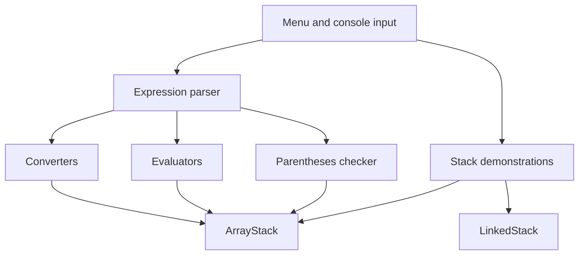
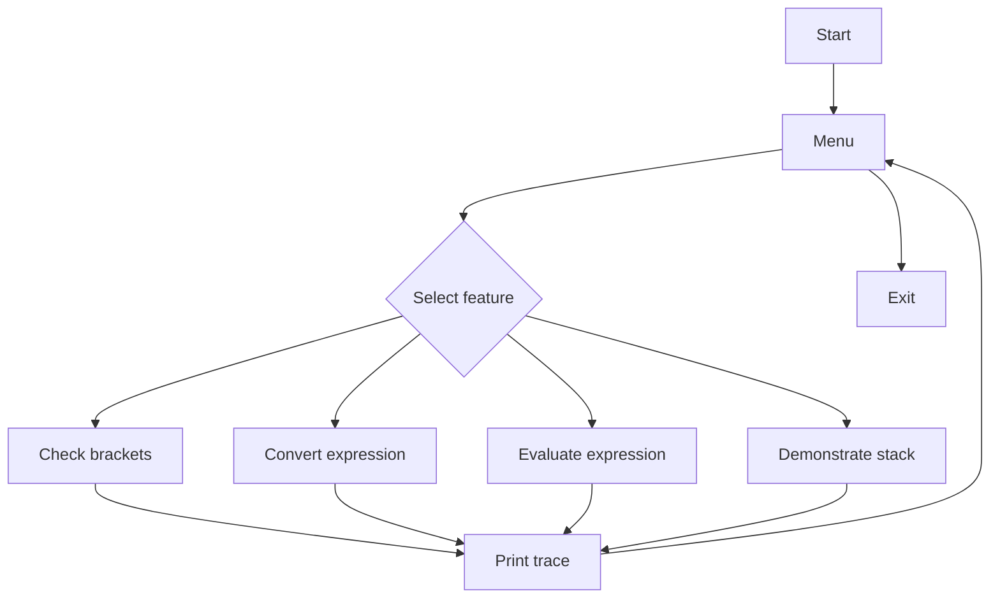
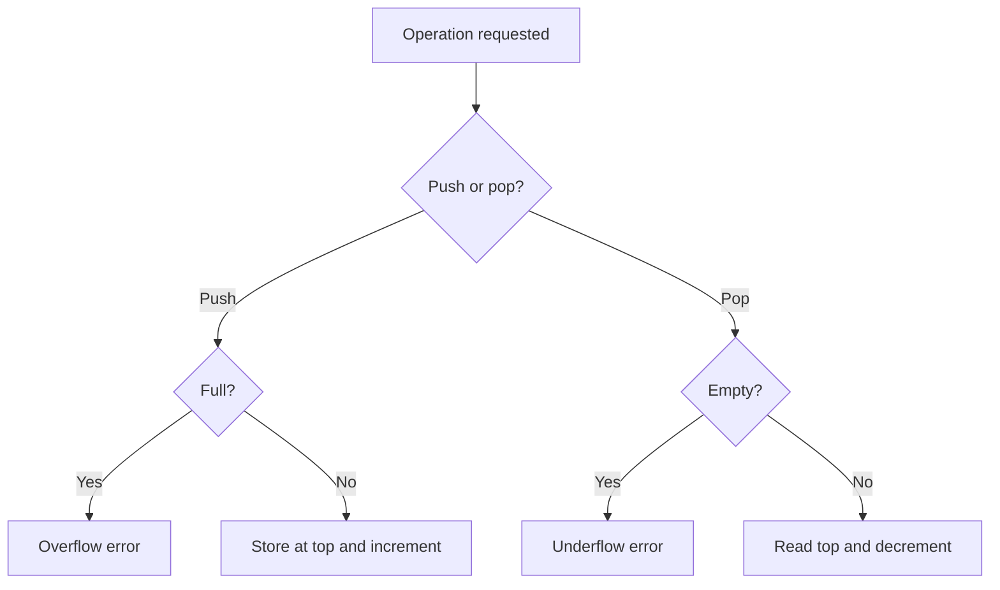
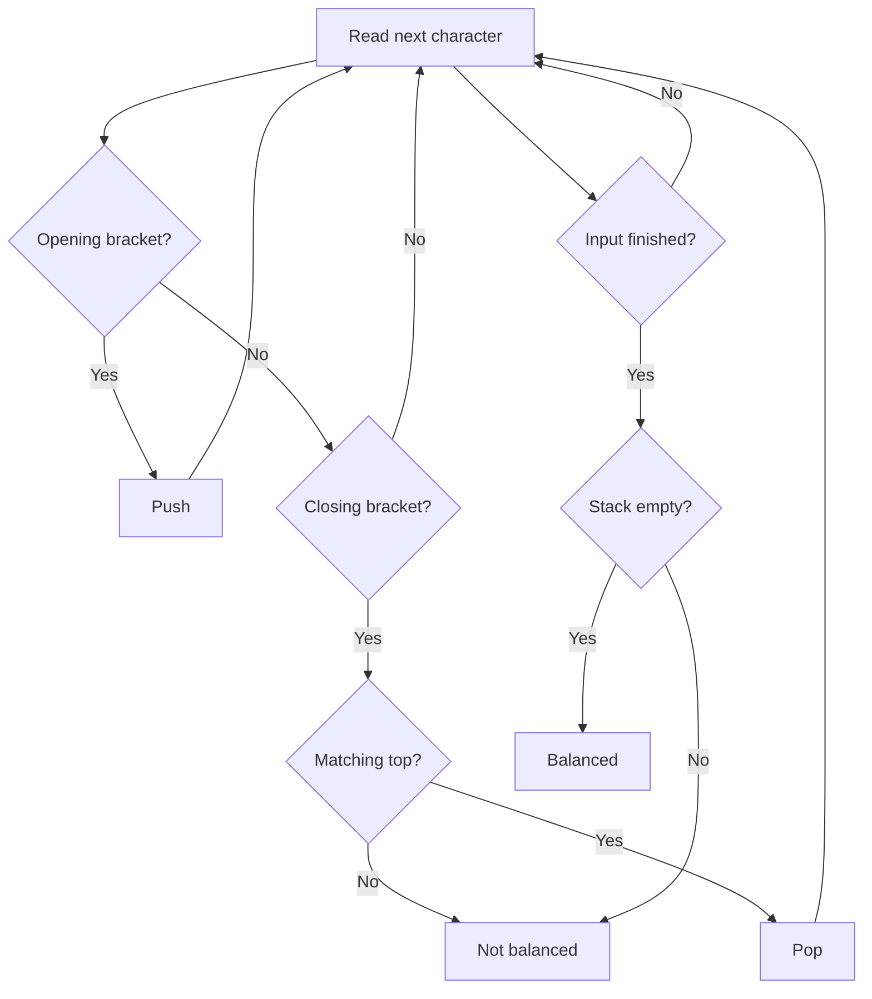
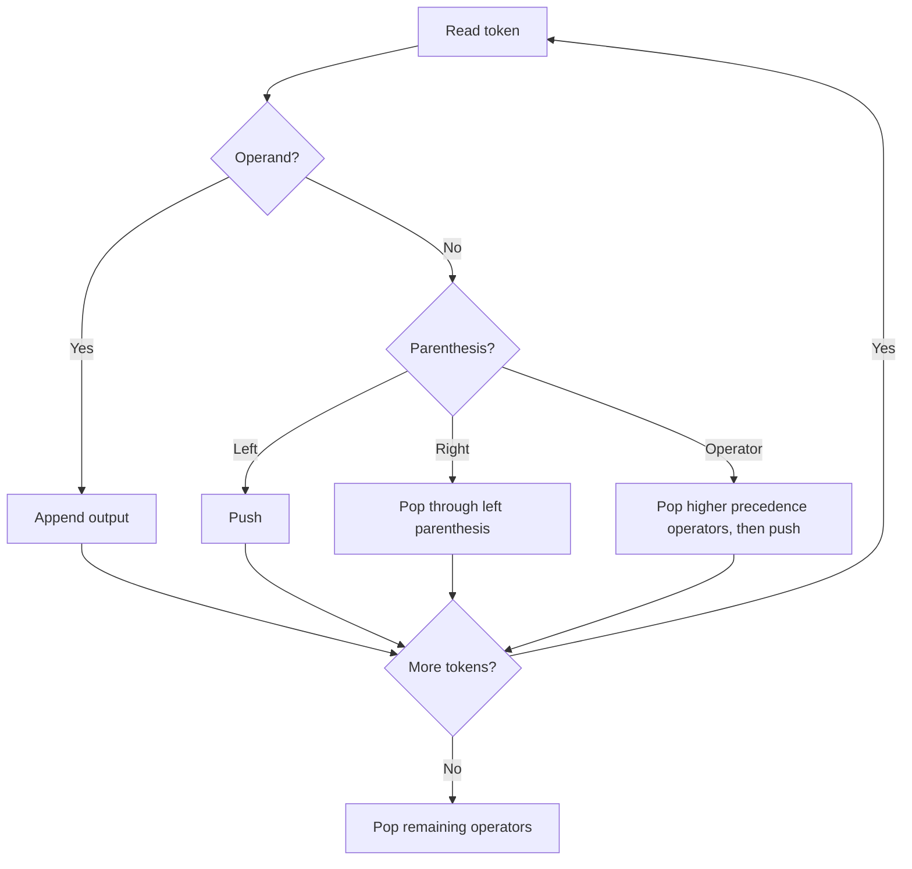
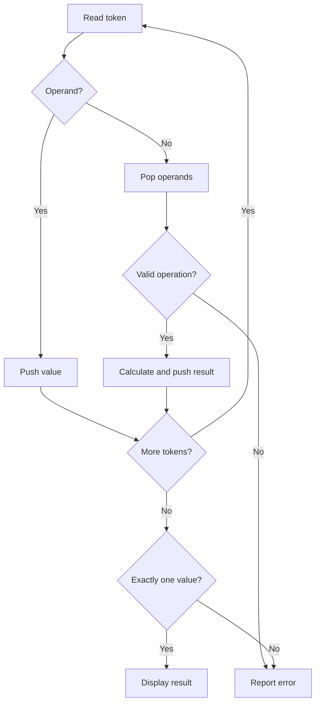

# Flowcharts and Architecture

## System architecture

```mermaid
flowchart TD
    UI[Menu and console input] --> P[Expression parser]
    UI --> S[Stack demonstrations]
    P --> C[Converters]
    P --> E[Evaluators]
    C --> A[ArrayStack]
    E --> A
    S --> A
    S --> L[LinkedStack]
    P --> B[Parentheses checker]
    B --> A
```

## Overall project flow

```mermaid
flowchart TD
    Start --> Menu
    Menu --> Choice{Select feature}
    Choice --> Brackets[Check brackets]
    Choice --> Convert[Convert expression]
    Choice --> Evaluate[Evaluate expression]
    Choice --> Demo[Demonstrate stack]
    Brackets --> Trace[Print trace]
    Convert --> Trace
    Evaluate --> Trace
    Demo --> Trace
    Trace --> Menu
    Menu --> Exit[Exit]
```

## Push and pop

```mermaid
flowchart TD
    A[Operation requested] --> B{Push or pop?}
    B -->|Push| C{Full?}
    C -->|Yes| E[Overflow error]
    C -->|No| F[Store at top and increment]
    B -->|Pop| G{Empty?}
    G -->|Yes| H[Underflow error]
    G -->|No| I[Read top and decrement]
```

## Balanced parentheses

```mermaid
flowchart TD
    A[Read next character] --> B{Opening bracket?}
    B -->|Yes| C[Push]
    B -->|No| D{Closing bracket?}
    D -->|No| A
    D -->|Yes| E{Matching top?}
    E -->|No| F[Not balanced]
    E -->|Yes| G[Pop]
    C --> A
    G --> A
    A --> H{Input finished?}
    H -->|No| A
    H -->|Yes| I{Stack empty?}
    I -->|Yes| J[Balanced]
    I -->|No| F
```

## Infix to postfix

```mermaid
flowchart TD
    A[Read token] --> B{Operand?}
    B -->|Yes| C[Append output]
    B -->|No| D{Parenthesis?}
    D -->|Left| E[Push]
    D -->|Right| F[Pop through left parenthesis]
    D -->|Operator| G[Pop higher precedence operators, then push]
    C --> H{More tokens?}
    E --> H
    F --> H
    G --> H
    H -->|Yes| A
    H -->|No| I[Pop remaining operators]
```

## Expression evaluation

```mermaid
flowchart TD
    A[Read token] --> B{Operand?}
    B -->|Yes| C[Push value]
    B -->|No| D[Pop operands]
    D --> E{Valid operation?}
    E -->|No| F[Report error]
    E -->|Yes| G[Calculate and push result]
    C --> H{More tokens?}
    G --> H
    H -->|Yes| A
    H -->|No| I{Exactly one value?}
    I -->|Yes| J[Display result]
    I -->|No| F
```
